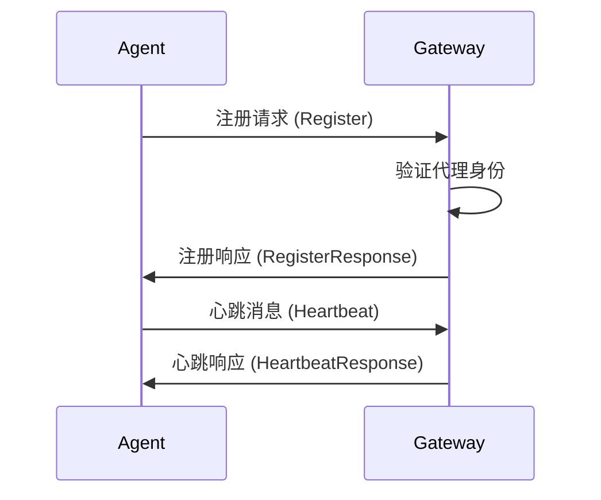
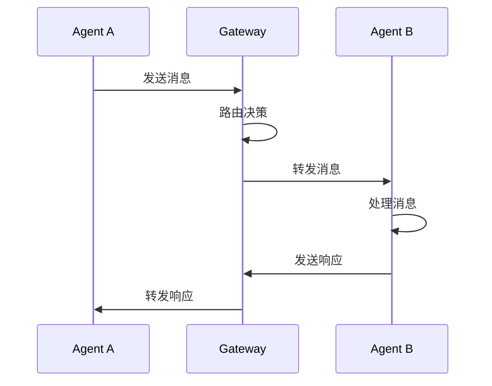

# A2A协议说明文档

## 概述

A2A（Agent-to-Agent）协议是一种用于智能代理之间通信的标准化协议。该协议定义了代理之间如何进行信息交换、任务协调和资源共享的规范。

## 协议特性

### 核心特性
- **分布式通信**: 支持多个代理节点之间的分布式通信
- **异步消息传递**: 基于异步消息传递机制，提高系统响应性
- **安全认证**: 内置安全认证机制，确保通信安全
- **负载均衡**: 支持智能负载均衡和故障转移
- **可扩展性**: 模块化设计，易于扩展和定制

### 技术特性
- **协议版本**: 支持多版本协议兼容
- **消息格式**: 基于JSON的标准化消息格式
- **传输层**: 支持TCP、WebSocket、HTTP等多种传输协议
- **压缩算法**: 支持多种数据压缩算法
- **加密机制**: 支持端到端加密

## 协议架构

### 整体架构

```
┌─────────────────┐    ┌─────────────────┐    ┌─────────────────┐
│    Agent A      │    │  A2A Gateway    │    │    Agent B      │
│                 │    │                 │    │                 │
│ ┌─────────────┐ │    │ ┌─────────────┐ │    │ ┌─────────────┐ │
│ │ A2A Client  │◄├────┤►│ Router      │◄├────┤►│ A2A Client  │ │
│ └─────────────┘ │    │ └─────────────┘ │    │ └─────────────┘ │
│ ┌─────────────┐ │    │ ┌─────────────┐ │    │ ┌─────────────┐ │
│ │ Message     │ │    │ │ Auth        │ │    │ │ Message     │ │
│ │ Handler     │ │    │ │ Manager     │ │    │ │ Handler     │ │
│ └─────────────┘ │    │ └─────────────┘ │    │ └─────────────┘ │
└─────────────────┘    └─────────────────┘    └─────────────────┘
```

### 组件说明

#### A2A Client
- 负责与其他代理建立连接
- 处理消息的发送和接收
- 管理连接状态和重连机制

#### A2A Gateway
- 中央路由节点，负责消息转发
- 提供负载均衡和故障转移
- 管理代理注册和发现

#### Message Handler
- 处理接收到的消息
- 执行业务逻辑
- 生成响应消息

## 消息格式

### 基本消息结构

```json
{
  "header": {
    "version": "1.0",
    "messageId": "uuid-string",
    "timestamp": "2025-06-02T09:12:00Z",
    "sender": "agent-id",
    "receiver": "agent-id",
    "messageType": "request|response|notification",
    "priority": "high|medium|low",
    "ttl": 30000
  },
  "body": {
    "action": "action-name",
    "parameters": {},
    "data": {}
  },
  "signature": "digital-signature"
}
```

### 消息类型

#### 1. 请求消息 (Request)
```json
{
  "header": {
    "messageType": "request",
    "action": "execute_task"
  },
  "body": {
    "action": "execute_task",
    "parameters": {
      "taskId": "task-123",
      "taskType": "data_processing",
      "priority": "high"
    },
    "data": {
      "input": "processing data"
    }
  }
}
```

#### 2. 响应消息 (Response)
```json
{
  "header": {
    "messageType": "response",
    "correlationId": "original-message-id"
  },
  "body": {
    "status": "success|error",
    "result": {},
    "error": {
      "code": "error-code",
      "message": "error description"
    }
  }
}
```

#### 3. 通知消息 (Notification)
```json
{
  "header": {
    "messageType": "notification",
    "action": "status_update"
  },
  "body": {
    "event": "task_completed",
    "data": {
      "taskId": "task-123",
      "status": "completed",
      "result": "processing result"
    }
  }
}
```

## 通信流程

### 代理注册流程



### 消息传递流程



## API接口

### 连接管理

#### 建立连接
```python
def connect(gateway_url: str, agent_id: str, credentials: dict) -> Connection:
    """
    建立与A2A网关的连接
    
    Args:
        gateway_url: 网关地址
        agent_id: 代理唯一标识
        credentials: 认证凭据
        
    Returns:
        Connection: 连接对象
    """
```

#### 断开连接
```python
def disconnect(connection: Connection) -> bool:
    """
    断开与网关的连接
    
    Args:
        connection: 连接对象
        
    Returns:
        bool: 断开是否成功
    """
```

### 消息操作

#### 发送消息
```python
def send_message(connection: Connection, message: Message) -> str:
    """
    发送消息到指定代理
    
    Args:
        connection: 连接对象
        message: 消息对象
        
    Returns:
        str: 消息ID
    """
```

#### 接收消息
```python
def receive_message(connection: Connection, timeout: int = 30) -> Message:
    """
    接收消息
    
    Args:
        connection: 连接对象
        timeout: 超时时间（秒）
        
    Returns:
        Message: 接收到的消息
    """
```

#### 发送请求并等待响应
```python
def send_request(connection: Connection, request: Message, timeout: int = 30) -> Message:
    """
    发送请求并等待响应
    
    Args:
        connection: 连接对象
        request: 请求消息
        timeout: 超时时间（秒）
        
    Returns:
        Message: 响应消息
    """
```

### 代理发现

#### 查找代理
```python
def find_agents(connection: Connection, criteria: dict) -> List[AgentInfo]:
    """
    根据条件查找代理
    
    Args:
        connection: 连接对象
        criteria: 查找条件
        
    Returns:
        List[AgentInfo]: 符合条件的代理列表
    """
```

#### 获取代理状态
```python
def get_agent_status(connection: Connection, agent_id: str) -> AgentStatus:
    """
    获取指定代理的状态
    
    Args:
        connection: 连接对象
        agent_id: 代理ID
        
    Returns:
        AgentStatus: 代理状态信息
    """
```

## 安全机制

### 认证方式

#### 1. Token认证
```json
{
  "authType": "token",
  "credentials": {
    "token": "jwt-token-string"
  }
}
```

#### 2. 证书认证
```json
{
  "authType": "certificate",
  "credentials": {
    "certificate": "x509-certificate",
    "privateKey": "private-key"
  }
}
```

#### 3. API Key认证
```json
{
  "authType": "apikey",
  "credentials": {
    "apiKey": "api-key-string",
    "secret": "secret-string"
  }
}
```

### 加密传输

- **TLS/SSL**: 传输层加密
- **消息级加密**: 端到端消息加密
- **数字签名**: 消息完整性验证

### 访问控制

- **基于角色的访问控制 (RBAC)**
- **基于属性的访问控制 (ABAC)**
- **API限流和配额管理**

## 错误处理

### 错误代码

| 错误代码 | 描述 | 处理建议 |
|---------|------|----------|
| A2A_001 | 连接超时 | 检查网络连接，重试连接 |
| A2A_002 | 认证失败 | 检查认证凭据，更新token |
| A2A_003 | 消息格式错误 | 检查消息格式，修正后重发 |
| A2A_004 | 目标代理不存在 | 检查代理ID，确认代理在线 |
| A2A_005 | 权限不足 | 检查访问权限，联系管理员 |
| A2A_006 | 消息队列满 | 等待队列空闲，降低发送频率 |
| A2A_007 | 协议版本不兼容 | 升级协议版本或使用兼容版本 |

### 重试机制

```python
class RetryPolicy:
    def __init__(self):
        self.max_retries = 3
        self.base_delay = 1.0
        self.max_delay = 30.0
        self.backoff_factor = 2.0
        
    def should_retry(self, error_code: str, attempt: int) -> bool:
        """判断是否应该重试"""
        if attempt >= self.max_retries:
            return False
            
        # 可重试的错误代码
        retryable_errors = ['A2A_001', 'A2A_006']
        return error_code in retryable_errors
        
    def get_delay(self, attempt: int) -> float:
        """计算重试延迟时间"""
        delay = self.base_delay * (self.backoff_factor ** attempt)
        return min(delay, self.max_delay)
```

## 性能优化

### 连接池管理

```python
class ConnectionPool:
    def __init__(self, max_connections: int = 10):
        self.max_connections = max_connections
        self.active_connections = []
        self.idle_connections = []
        
    def get_connection(self) -> Connection:
        """获取连接"""
        if self.idle_connections:
            return self.idle_connections.pop()
        elif len(self.active_connections) < self.max_connections:
            return self.create_connection()
        else:
            raise Exception("连接池已满")
            
    def return_connection(self, connection: Connection):
        """归还连接"""
        if connection.is_healthy():
            self.idle_connections.append(connection)
        else:
            connection.close()
```

### 消息批处理

```python
def send_batch_messages(connection: Connection, messages: List[Message]) -> List[str]:
    """
    批量发送消息
    
    Args:
        connection: 连接对象
        messages: 消息列表
        
    Returns:
        List[str]: 消息ID列表
    """
    batch_message = {
        "header": {
            "messageType": "batch",
            "batchSize": len(messages)
        },
        "body": {
            "messages": messages
        }
    }
    return send_message(connection, batch_message)
```

### 压缩优化

支持的压缩算法：
- **gzip**: 通用压缩，兼容性好
- **lz4**: 高速压缩，适合实时场景
- **zstd**: 高压缩比，适合大数据传输

## 监控和日志

### 监控指标

#### 连接指标
- 活跃连接数
- 连接建立/断开频率
- 连接错误率

#### 消息指标
- 消息发送/接收速率
- 消息延迟分布
- 消息错误率

#### 性能指标
- CPU使用率
- 内存使用率
- 网络带宽使用率

### 日志格式

```json
{
  "timestamp": "2025-06-02T09:12:00Z",
  "level": "INFO|WARN|ERROR",
  "component": "a2a-client",
  "agentId": "agent-123",
  "messageId": "msg-456",
  "action": "send_message",
  "duration": 150,
  "status": "success",
  "details": {
    "targetAgent": "agent-789",
    "messageSize": 1024
  }
}
```

## 配置说明

### 客户端配置

```yaml
a2a:
  client:
    # 连接配置
    connection:
      gateway_url: "wss://gateway.example.com:8080"
      timeout: 30
      keepalive: 60
      
    # 认证配置
    auth:
      type: "token"
      token: "${A2A_TOKEN}"
      
    # 重试配置
    retry:
      max_retries: 3
      base_delay: 1.0
      max_delay: 30.0
      
    # 压缩配置
    compression:
      enabled: true
      algorithm: "gzip"
      threshold: 1024
      
    # 日志配置
    logging:
      level: "INFO"
      format: "json"
      file: "/var/log/a2a-client.log"
```

### 网关配置

```yaml
a2a:
  gateway:
    # 服务器配置
    server:
      host: "0.0.0.0"
      port: 8080
      max_connections: 1000
      
    # 路由配置
    routing:
      strategy: "round_robin"
      health_check_interval: 30
      
    # 安全配置
    security:
      tls_enabled: true
      cert_file: "/etc/ssl/server.crt"
      key_file: "/etc/ssl/server.key"
      
    # 限流配置
    rate_limit:
      enabled: true
      requests_per_second: 100
      burst_size: 200
```

## 使用示例

### Python客户端示例

```python
import asyncio
from a2a_client import A2AClient, Message

async def main():
    # 创建客户端
    client = A2AClient(
        gateway_url="wss://gateway.example.com:8080",
        agent_id="my-agent",
        auth_token="your-token"
    )
    
    try:
        # 连接到网关
        await client.connect()
        
        # 发送消息
        message = Message(
            receiver="target-agent",
            action="process_data",
            data={"input": "hello world"}
        )
        
        response = await client.send_request(message, timeout=30)
        print(f"收到响应: {response.body}")
        
        # 监听消息
        async for incoming_message in client.listen():
            print(f"收到消息: {incoming_message}")
            
            # 发送响应
            response = Message(
                receiver=incoming_message.sender,
                message_type="response",
                correlation_id=incoming_message.header.message_id,
                data={"status": "processed"}
            )
            await client.send_message(response)
            
    finally:
        await client.disconnect()

if __name__ == "__main__":
    asyncio.run(main())
```

### JavaScript客户端示例

```javascript
const { A2AClient } = require('a2a-client-js');

async function main() {
    const client = new A2AClient({
        gatewayUrl: 'wss://gateway.example.com:8080',
        agentId: 'my-agent',
        authToken: 'your-token'
    });
    
    try {
        // 连接到网关
        await client.connect();
        
        // 监听消息
        client.on('message', async (message) => {
            console.log('收到消息:', message);
            
            // 发送响应
            await client.sendResponse(message.header.messageId, {
                status: 'processed',
                result: 'success'
            });
        });
        
        // 发送请求
        const response = await client.sendRequest({
            receiver: 'target-agent',
            action: 'process_data',
            data: { input: 'hello world' }
        });
        
        console.log('收到响应:', response);
        
    } catch (error) {
        console.error('错误:', error);
    } finally {
        await client.disconnect();
    }
}

main();
```

## 最佳实践

### 1. 连接管理
- 使用连接池管理多个连接
- 实现自动重连机制
- 定期发送心跳消息

### 2. 消息设计
- 保持消息结构简洁
- 使用合适的消息优先级
- 设置合理的TTL值

### 3. 错误处理
- 实现完善的错误处理机制
- 使用指数退避重试策略
- 记录详细的错误日志

### 4. 性能优化
- 使用消息批处理减少网络开销
- 启用压缩减少传输数据量
- 合理设置超时时间

### 5. 安全考虑
- 使用强认证机制
- 启用传输层加密
- 实施访问控制策略

## 故障排除

### 常见问题

#### 1. 连接失败
**症状**: 无法连接到A2A网关
**可能原因**:
- 网络连接问题
- 网关服务未启动
- 认证凭据错误
- 防火墙阻止连接

**解决方案**:
```bash
# 检查网络连接
ping gateway.example.com

# 检查端口是否开放
telnet gateway.example.com 8080

# 检查认证凭据
curl -H "Authorization: Bearer your-token" https://gateway.example.com/auth/verify
```

#### 2. 消息发送失败
**症状**: 消息发送后收到错误响应
**可能原因**:
- 目标代理离线
- 消息格式错误
- 权限不足
- 网关过载

**解决方案**:
```python
# 检查目标代理状态
agent_status = await client.get_agent_status("target-agent")
if agent_status.status != "online":
    print("目标代理离线")

# 验证消息格式
try:
    message.validate()
except ValidationError as e:
    print(f"消息格式错误: {e}")
```

#### 3. 性能问题
**症状**: 消息延迟高或吞吐量低
**可能原因**:
- 网络延迟
- 消息过大
- 连接数不足
- 服务器负载高

**解决方案**:
```python
# 启用压缩
client.enable_compression("gzip")

# 使用连接池
pool = ConnectionPool(max_connections=20)

# 批量发送消息
await client.send_batch_messages(messages)
```

## 版本历史

### v1.0.0 (2025-06-02)
- 初始版本发布
- 支持基本的代理间通信
- 实现消息路由和转发
- 提供安全认证机制

### 未来规划

#### v1.1.0
- 支持消息持久化
- 增加消息优先级队列
- 实现分布式负载均衡

#### v1.2.0
- 支持流式消息传输
- 增加消息过滤和转换
- 实现动态路由配置

#### v2.0.0
- 重构协议架构
- 支持插件化扩展
- 增加图形化管理界面

## 贡献指南

### 开发环境搭建

```bash
# 克隆仓库
git clone https://github.com/your-org/a2a-protocol.git
cd a2a-protocol

# 安装依赖
pip install -r requirements-dev.txt

# 运行测试
pytest tests/

# 启动开发服务器
python -m a2a.gateway --config dev-config.yaml
```

### 提交规范

- 使用语义化提交信息
- 添加单元测试
- 更新文档
- 通过代码审查

## 许可证

本项目采用 MIT 许可证，详见 [LICENSE](LICENSE) 文件。

## 联系方式

- 项目主页: https://github.com/your-org/a2a-protocol
- 问题反馈: https://github.com/your-org/a2a-protocol/issues
- 邮件联系: a2a-support@example.com
- 技术文档: https://docs.a2a-protocol.org

---

*本文档最后更新时间: 2025-06-02*